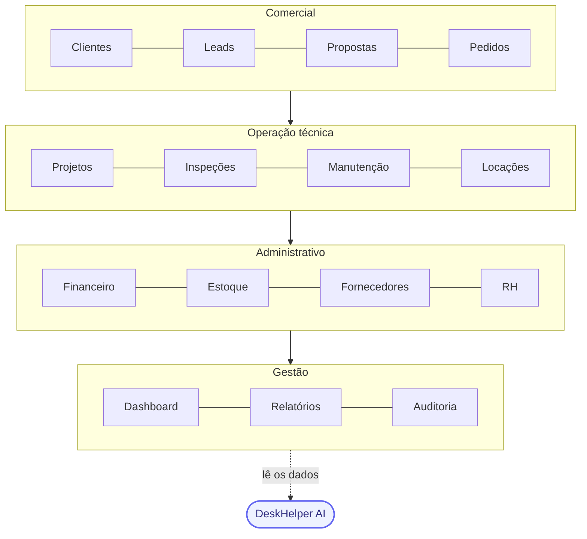
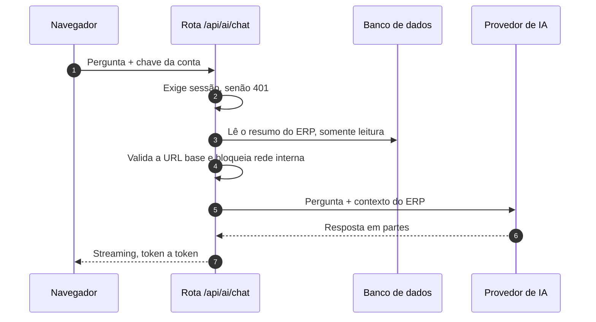
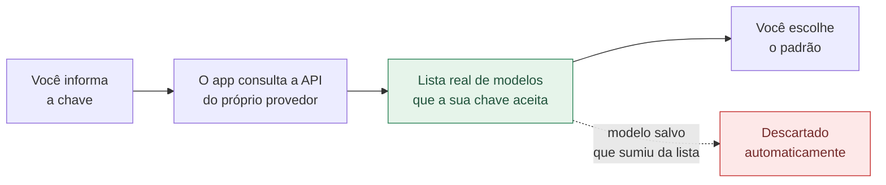
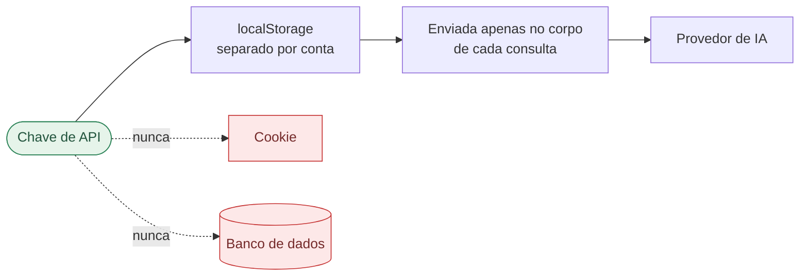
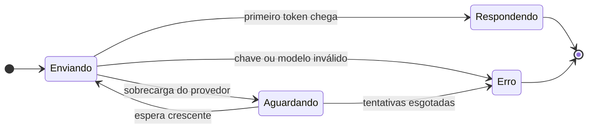
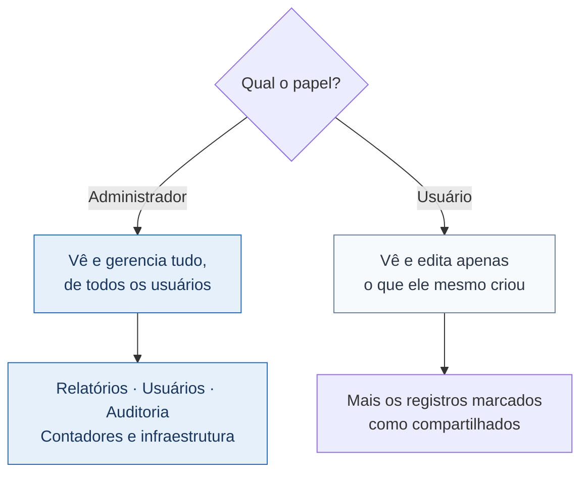
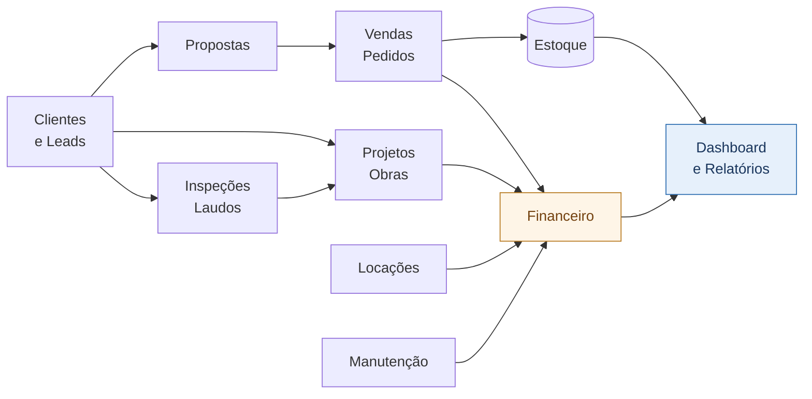
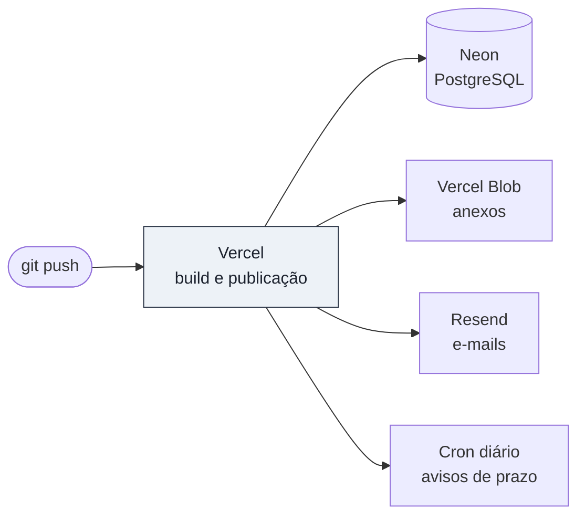
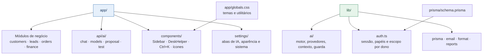

<div align="center">

# DRR Projetos e Equipamentos

### Sistema de Gestão — ERP + CRM


Gestão completa para **estruturas de armazenagem logística** — porta-paletes,
gradil NR12, wire deck e acessórios de proteção.

CRM, vendas, locação, projetos, inspeções, manutenção, estoque, financeiro, RH e
relatórios num só lugar — com controle de acesso por usuário, avisos por e-mail e
um assistente de IA ligado aos dados do sistema.

<br/>

<a href="#deskhelper-ai"></a>
<a href="#controle-de-acesso"></a>
<a href="#módulos"></a>

</div>

---

## Sumário

<table>
<tr>
<td valign="top" width="50%">

**Produto**

- [Visão geral](#visão-geral)
- [DeskHelper AI](#deskhelper-ai)
- [Controle de acesso](#controle-de-acesso)
- [Módulos](#módulos)
- [Integração entre módulos](#integração-entre-módulos)
- [E-mails](#e-mails)

</td>
<td valign="top" width="50%">

**Técnico**

- [Como rodar](#como-rodar-local)
- [Deploy](#deploy)
- [Estrutura do código](#estrutura-do-código)
- [Convenções de interface](#convenções-de-interface)
- [Stack](#stack)

</td>
</tr>
</table>

---

## Visão geral



<table>
<tr>
<td valign="top" width="50%">

**Comercial e operação**

- Leads em Kanban com numeração sequencial `AAMMNN`, motivo de perda e conversão
- Propostas em papel timbrado, prontas para impressão
- Pedidos que baixam estoque e geram financeiro
- Inspeções com risco verde/amarelo/vermelho e nº da ART
- Contratos de manutenção recorrente e locação com devolução

</td>
<td valign="top" width="50%">

**Plataforma**

- **DeskHelper AI** responde sobre os dados reais e redige textos
- **Ctrl + K** vai a qualquer módulo ou pergunta à IA
- Anexos (PDF/Word) no Vercel Blob
- Lixeira com expurgo automático em 30 dias
- Auditoria de quem criou, alterou ou excluiu
- 14 temas, claro/escuro/sistema

</td>
</tr>
</table>

---

## DeskHelper AI

Abre pela barra lateral ou pelo **Ctrl + K**. Recebe um resumo dos dados do ERP
— pipeline, contas vencidas, inspeções da semana, estoque baixo — e responde em
português, com o texto saindo em tempo real e botão para interromper.

Em cada proposta (`/proposals/[id]`) há um **assistente dedicado**, que redige
escopo técnico, termos comerciais, análise de riscos de vistoria ou revisa o texto.

### O caminho de uma pergunta



### Provedores

<table>
<tr>
<td valign="top" width="33%">

**Nuvem**

- Anthropic Claude
- Google Gemini
- OpenAI
- DeepSeek

</td>
<td valign="top" width="33%">

**Nuvem**

- Groq
- Mistral
- xAI (Grok)
- Cohere

</td>
<td valign="top" width="33%">

**Outros**

- OpenRouter
- Ollama (offline)
- Servidor próprio

</td>
</tr>
</table>

### A lista de modelos vem da conta, não do código



> [!NOTE]
> Provedores lançam e aposentam modelos o tempo todo. Uma lista escrita no código
> envelhece — o `gemini-2.0-flash`, por exemplo, saiu do ar e passou a devolver
> 404. Por isso a lista exibida vem sempre da API do próprio usuário.

### Onde a chave fica guardada



| Onde | O quê |
|---|---|
| `localStorage`, separado por conta | A chave de API |
| Cookie, separado por conta | Provedor, modelo e URL base — **nunca a chave** |
| Banco de dados | Nada |

**Por quê:** cookie viaja em toda requisição e é legível por qualquer script da
página. E, separado por conta, num computador compartilhado quem entrar depois não
herda nem gasta a chave de quem usou antes.

> [!IMPORTANT]
> Como a chave nunca sai do navegador, ela não segue o usuário entre computadores.
> Para uma chave única da equipe, defina a variável de ambiente no servidor e deixe
> o campo em branco.

<details>
<summary><b>Variáveis de ambiente das chaves de IA</b></summary>

<br/>

| Provedor | Variável |
|---|---|
| Anthropic | `ANTHROPIC_API_KEY` |
| Google Gemini | `GEMINI_API_KEY` ou `GOOGLE_API_KEY` |
| OpenAI | `OPENAI_API_KEY` |
| DeepSeek | `DEEPSEEK_API_KEY` |
| Groq | `GROQ_API_KEY` |
| Mistral | `MISTRAL_API_KEY` |
| xAI | `XAI_API_KEY` |
| Cohere | `COHERE_API_KEY` |
| OpenRouter | `OPENROUTER_API_KEY` |
| Ollama | `OLLAMA_BASE_URL` |

</details>

### O que acontece quando falha



- Falhas passageiras **são repetidas sozinhas** e a tela avisa que está tentando.
- No streaming a repetição só ocorre **antes do primeiro token** — depois disso,
  repetir duplicaria a resposta na tela.
- Chave inválida e modelo inexistente **não** são repetidos: repetir não resolve.

> [!WARNING]
> As rotas `/api/ai/*` exigem sessão e respondem `401` em JSON. A URL base enviada
> pelo navegador é validada antes de qualquer chamada: endereços de rede interna
> são bloqueados (proteção contra SSRF), exceto nos provedores locais.

---

## Controle de acesso



- Cada registro de CRM/vendas tem um **dono**; o usuário comum só enxerga os seus.
- O botão **compartilhar** libera aquele item para todos.
- **Produtos/equipamentos e fornecedores** são catálogo compartilhado da empresa.
- Cada registro mostra **"adicionado por &lt;nome&gt;"** para o admin localizar rápido.
- A criação de usuário pode exigir **verificação de e-mail** antes do primeiro login.

> [!NOTE]
> Em **Configurações › Sistema**, números do sistema inteiro, infraestrutura e
> instruções de terminal aparecem somente para administradores. Os demais veem
> apenas os dados da própria conta.

---

## Módulos

<details open>
<summary><b>19 rotas</b></summary>

<br/>

| Módulo | Rota | O que faz |
|---|---|---|
| Dashboard | `/` | KPIs unificados + painel de pendências |
| Clientes (CRM) | `/customers` | Cadastro + linha do tempo 360° de cada cliente |
| Leads / Orçamentos | `/leads` | Kanban com nº sequencial e conversão em cliente |
| Propostas | `/proposals/[id]` | Papel timbrado para impressão + assistente de IA |
| Projetos / Obras | `/projects` | Engenharia e montagem, com faturamento por etapas |
| Inspeções / Laudos | `/inspections` | Vistorias com risco, engenheiro e nº da ART |
| Manutenção | `/maintenance` | Contratos recorrentes e reagendamento |
| Equipamentos / Serviços | `/products` | Catálogo com estoque e itens locáveis |
| Vendas / Pedidos | `/orders` | Baixa estoque e gera conta a receber |
| Locações | `/rentals` | Aluguel, devolução e faturamento mensal |
| Agendamentos | `/appointments` | Visitas e reuniões ligadas a clientes e equipe |
| Fornecedores | `/suppliers` | Cadastro ligado às contas a pagar |
| RH / Equipe | `/hr` | Funcionários, categorias, metas e comissão |
| Financeiro | `/finance` | Contas a pagar/receber e pagamentos parciais |
| Relatórios *(admin)* | `/reports` | Curva ABC, comissões, perdas + export CSV/PDF |
| Usuários *(admin)* | `/users` | Gestão de logins, papéis e desempenho |
| Auditoria *(admin)* | `/audit` | Histórico de quem criou, alterou ou excluiu |
| Lixeira | `/trash` | Itens arquivados, com expurgo automático em 30 dias |
| Configurações | `/settings` | Abas de IA, aparência, preferências e sistema |

</details>

---

## Integração entre módulos



| De → Para | O que acontece |
|---|---|
| CRM → Vendas | Um lead vira cliente; o cliente é a origem dos pedidos |
| Vendas → Estoque | Confirmar um pedido **baixa o estoque**, e devolve se cancelado |
| Vendas/Projetos → Financeiro | Geram **contas a receber** automaticamente |
| Tudo → Dashboard | Consolidado a partir de todos os módulos |

---

## E-mails

| Fluxo | Quando dispara |
|---|---|
| **Verificação de conta** | Ao criar um usuário, antes do primeiro acesso |
| **Reset de senha** | "Esqueci a senha", com código de 6 dígitos |
| **Avisos de prazo** | Cron diário em `/api/cron/alerts` |

O aviso diário resume contas a vencer, inspeções agendadas, visitas de manutenção
e devoluções de locação próximas — para o dono de cada item; admins recebem tudo.

> [!TIP]
> Sem `RESEND_API_KEY` configurada o app funciona normalmente, apenas não envia
> e-mails (a verificação é pulada).

---

## Como rodar (local)

Pré-requisito: um banco **PostgreSQL** — uma branch do Neon serve bem para dev.

```bash
npm install                 # dependências

# .env — defina pelo menos:
#   DATABASE_URL="postgresql://...?sslmode=require"        (conexão pooled)
#   DATABASE_URL_UNPOOLED="postgresql://..."               (conexão direta)
#   SESSION_SECRET="uma-string-longa-e-aleatoria"

npm run db:push             # cria as tabelas a partir do schema
npm run db:seed             # popula dados de exemplo + usuários admin
npm run dev                 # http://localhost:3000
```

Para recriar o banco do zero: `npm run db:reset` *(apaga tudo)*.

O seed cria **Vendedor Demo** e **Representante Demo** como administradores. A senha inicial está em
`prisma/seed.mjs` — **troque-a** em uso real, pela tela de Usuários ou pelo reset.

> [!CAUTION]
> O `DATABASE_URL` precisa começar com `postgresql://`. Um valor de SQLite
> (`file:./dev.db`) faz o Prisma recusar a conexão e **nenhuma página carrega**,
> porque o layout consulta o usuário logado a cada requisição.

---

## Deploy



1. Crie um PostgreSQL no **Neon** e rode `npx prisma db push` apontando para ele.
2. Configure as variáveis na Vercel (modelo em [`.env.production.example`](.env.production.example)).
3. O **cron de avisos** já está em [`vercel.json`](vercel.json), 1x/dia.
4. `git push` → a Vercel builda e publica.

<details>
<summary><b>Variáveis de ambiente</b></summary>

<br/>

| Variável | Para quê |
|---|---|
| `DATABASE_URL`, `DATABASE_URL_UNPOOLED` | Conexão Neon, pooled e direta |
| `SESSION_SECRET` | Segredo do cookie de sessão |
| `BLOB_READ_WRITE_TOKEN` | Vercel Blob (anexos) |
| `RESEND_API_KEY`, `EMAIL_FROM`, `APP_URL` | E-mail (opcional) |
| `CRON_SECRET` | Protege o cron de avisos |
| Chaves de IA | Opcional — veja a seção do DeskHelper AI |

</details>

---

## Estrutura do código



| Arquivo | Responsabilidade |
|---|---|
| `lib/ai/client.ts` | Motor único: streaming, timeout e novas tentativas |
| `lib/ai/providers.ts` | Catálogo dos 11 provedores |
| `lib/ai/context.ts` | Resumo do ERP que vira contexto do modelo |
| `lib/ai/settings.ts` | Chave efetiva, URL base e defesa contra SSRF |
| `lib/ai/guard.ts` | Exige sessão nas rotas de IA |
| `lib/auth.ts` | Sessão, papéis e escopo por dono |

---

## Convenções de interface

> [!WARNING]
> Duas regras que evitam bugs difíceis de enxergar. Ambas já causaram estilo que
> simplesmente não era aplicado — e ninguém percebia, porque nada quebrava.

**1. Não use o prefixo `dark:`**

O claro/escuro aqui não é a classe `.dark` do Tailwind: é o atributo `data-mode`
no `<html>`, que troca as variáveis CSS de `slate` e `white`.

| Classe | O que realmente acontece |
|---|---|
| `bg-white` | Já vira superfície escura sozinha |
| `text-slate-900` | Já vira texto claro sozinho |
| `dark:text-white` | No modo escuro renderiza texto quase **preto**, porque `white` aponta para a superfície do tema |

**2. Não use opacidade nas cores `brand`**

`bg-brand-600/10` **não gera classe nenhuma**: as cores brand são variáveis CSS
opacas, e o modificador de opacidade do Tailwind exige `rgb(... / <alpha-value>)`.

| Utilitário | Uso |
|---|---|
| `accent-soft` | Fundo suave na cor do tema |
| `accent-border` | Borda na cor do tema |
| `accent-selected` | Cartão ou opção marcada |
| `accent-icon` | Ícone na cor do tema |

Todos definidos em `app/globals.css` com `color-mix`.

---

## Stack

| Camada | Tecnologia |
|---|---|
| Aplicação | Next.js 15 — App Router, Server Actions, Middleware + React 18 |
| Linguagem | TypeScript |
| Dados | Prisma 6 + PostgreSQL (Neon) |
| Interface | Tailwind CSS 3 — 14 temas, claro/escuro/sistema |
| E-mail | Resend |
| Infra | Vercel — hospedagem, Blob e Cron |
| Autenticação | Sem dependências externas (scrypt + HMAC via Web Crypto) |
| IA | HTTP direto aos provedores, sem SDKs — um motor cobre os 11 |

<div align="center">
<br/>
<sub>DRR Projetos e Equipamentos · Sistema interno de gestão</sub>
</div>
