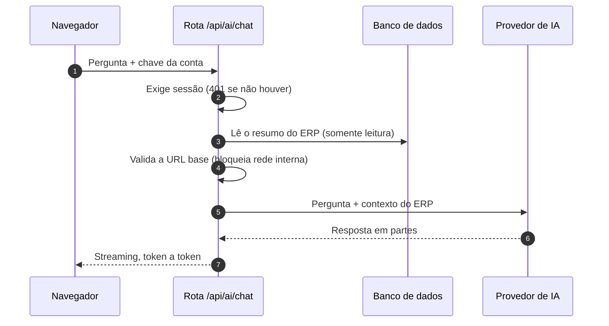
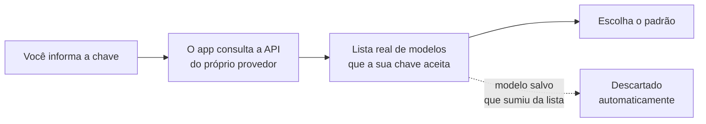
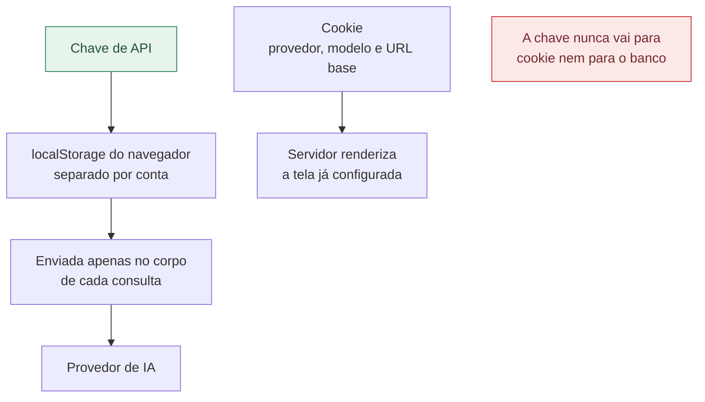
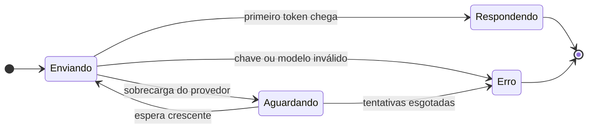
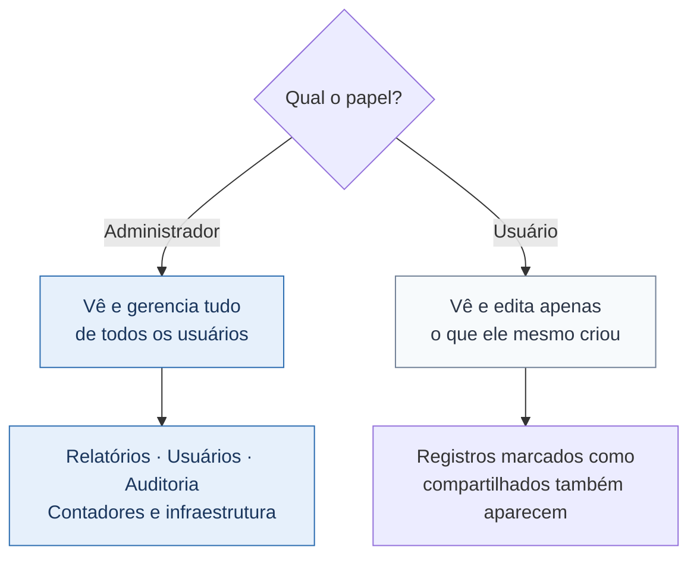
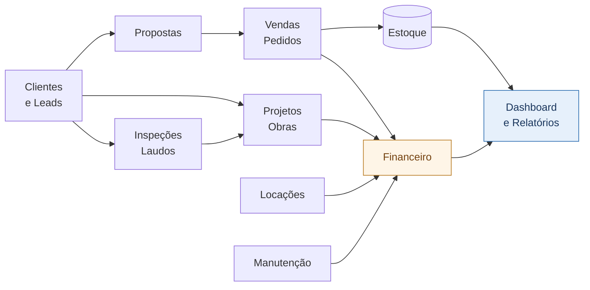
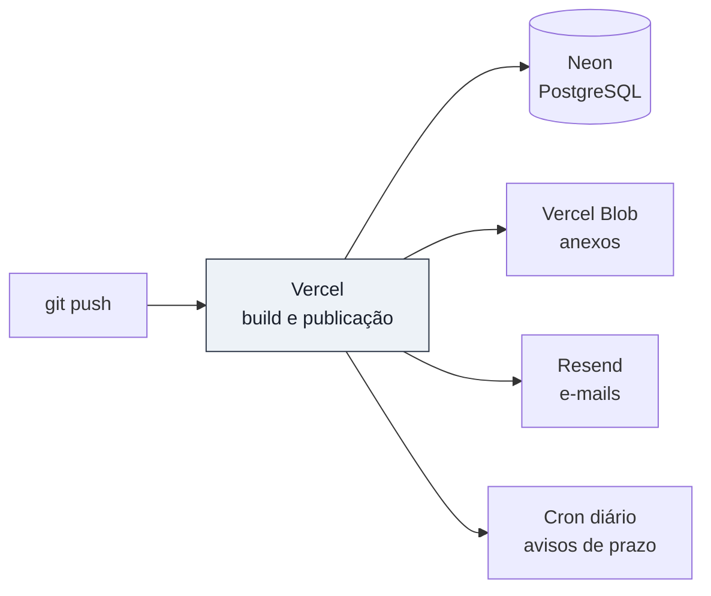

<div align="center">

# DRR Projetos e Equipamentos

### Sistema de Gestão — ERP + CRM


Gestão completa para **estruturas de armazenagem logística** — porta-paletes,
gradil NR12, wire deck e acessórios de proteção.

CRM, vendas, locação, projetos, inspeções, manutenção, estoque, financeiro, RH e
relatórios num só lugar — com controle de acesso por usuário, avisos por e-mail e
um assistente de IA ligado aos dados do sistema.

</div>

---

## Sumário

| Seção | Conteúdo |
|---|---|
| [Visão geral](#visão-geral) | O que o sistema faz, em blocos |
| [DeskHelper AI](#deskhelper-ai) | O assistente, os provedores e as chaves |
| [Controle de acesso](#controle-de-acesso) | Papéis, dono do registro e o que cada um vê |
| [Módulos](#módulos) | Tabela de rotas |
| [Integração entre módulos](#integração-entre-módulos) | Como um alimenta o outro |
| [E-mails](#e-mails) | Verificação, reset e avisos de prazo |
| [Como rodar](#como-rodar-local) | Passo a passo local |
| [Deploy](#deploy) | Vercel, Neon e variáveis |
| [Estrutura do código](#estrutura-do-código) | Onde fica cada coisa |
| [Convenções de interface](#convenções-de-interface) | Duas armadilhas do projeto |

---

## Visão geral

```
┌─────────────────────────────────────────────────────────────────────────┐
│                             COMERCIAL                                   │
│   Clientes (CRM)  ·  Leads / Orçamentos  ·  Propostas  ·  Pedidos       │
├─────────────────────────────────────────────────────────────────────────┤
│                          OPERAÇÃO TÉCNICA                               │
│   Projetos / Obras  ·  Inspeções e Laudos  ·  Manutenção  ·  Locações   │
├─────────────────────────────────────────────────────────────────────────┤
│                       ADMINISTRATIVO E APOIO                            │
│   Financeiro  ·  Estoque  ·  Fornecedores  ·  RH  ·  Agendamentos       │
├─────────────────────────────────────────────────────────────────────────┤
│                          GESTÃO E ANÁLISE                               │
│   Dashboard  ·  Relatórios  ·  Auditoria  ·  Usuários  ·  Lixeira       │
└─────────────────────────────────────────────────────────────────────────┘
                                    ▲
                        DeskHelper AI lê estes dados
                          e responde em linguagem natural
```

**Destaques**

- **CRM & funil** — leads em Kanban com numeração sequencial (`AAMMNN`), motivo de
  perda e conversão de lead em cliente.
- **Vendas, estoque e locação** — pedidos que baixam estoque e geram financeiro;
  contratos de locação com devolução e faturamento mensal.
- **Operação técnica** — obras, inspeções com risco verde/amarelo/vermelho e ART,
  e contratos de manutenção recorrente.
- **DeskHelper AI** — responde sobre os dados reais e redige escopos e mensagens.
- **Busca rápida (Ctrl + K)** — vai a qualquer módulo ou manda a pergunta à IA.
- **Anexos** — propostas, ARTs, laudos e contratos no Vercel Blob.
- **Produtividade** — busca e paginação, lixeira com expurgo em 30 dias, auditoria
  e 14 temas (claro/escuro/sistema).

---

## DeskHelper AI

Abre pela barra lateral ou pelo **Ctrl + K**. Recebe um resumo dos dados do ERP
— pipeline, contas vencidas, inspeções da semana, estoque baixo — e responde em
português, com o texto saindo em tempo real e botão para interromper.

Em cada proposta (`/proposals/[id]`) há um **assistente dedicado**, que redige
escopo técnico, termos comerciais, análise de riscos de vistoria ou revisa o texto.

### O caminho de uma pergunta



### Provedores

| | Provedor | Observação |
|---|---|---|
| 1 | Anthropic Claude | Bom para texto técnico e análise |
| 2 | Google Gemini | Aguenta documentos longos; tem faixa gratuita |
| 3 | OpenAI | Uso geral |
| 4 | DeepSeek | Melhor custo por raciocínio |
| 5 | Groq | O mais rápido para responder |
| 6 | Mistral | Europeu, multilíngue |
| 7 | xAI (Grok) | Respostas diretas |
| 8 | Cohere | Focado em documentos da empresa |
| 9 | OpenRouter | Vários fornecedores com uma chave só |
| 10 | Ollama | Roda offline, na própria máquina |
| 11 | Servidor próprio | Qualquer servidor no formato de API da OpenAI |

### A lista de modelos vem da conta, não do código

Provedores lançam e aposentam modelos o tempo todo. Uma lista escrita no código
envelhece — o `gemini-2.0-flash`, por exemplo, saiu do ar e passou a devolver 404.



### Onde a chave fica guardada



| Onde | O quê |
|---|---|
| `localStorage`, separado por conta | A chave de API |
| Cookie, separado por conta | Provedor, modelo e URL base — **nunca a chave** |
| Banco de dados | Nada |

**Por quê**

- **Cookie viaja em toda requisição** e é legível por qualquer script da página.
- **Separado por conta:** num computador compartilhado, quem entrar depois não
  herda (nem gasta) a chave de quem usou antes.

> **Consequência:** a chave não segue o usuário entre computadores. Para uma chave
> única da equipe, use a variável de ambiente do servidor e deixe o campo em branco.

### Chaves no servidor (opcional)

```
ANTHROPIC_API_KEY   GEMINI_API_KEY (ou GOOGLE_API_KEY)   OPENAI_API_KEY
DEEPSEEK_API_KEY    GROQ_API_KEY    MISTRAL_API_KEY      XAI_API_KEY
COHERE_API_KEY      OPENROUTER_API_KEY                   OLLAMA_BASE_URL
```

### O que acontece quando falha



- Falhas passageiras **são repetidas sozinhas** e a tela avisa que está tentando.
- No streaming a repetição só ocorre **antes do primeiro token** — depois disso,
  repetir duplicaria a resposta na tela.
- Chave inválida e modelo inexistente **não** são repetidos: repetir não resolve.

### Segurança das rotas

As rotas `/api/ai/chat`, `/api/ai/models`, `/api/ai/proposal` e `/api/ai/test`
**exigem sessão** e respondem `401` em JSON. A URL base enviada pelo navegador é
validada antes de qualquer chamada: endereços de rede interna são bloqueados
(proteção contra SSRF), exceto nos provedores locais, onde isso é o esperado.

---

## Controle de acesso



| Papel | O que enxerga |
|---|---|
| **Administrador** | Tudo, de todos os usuários, e gerencia os logins |
| **Usuário** | Apenas o que ele mesmo criou (CRM/vendas) |

- Cada registro de CRM/vendas tem um **dono**; o usuário comum só enxerga os seus.
- O botão **compartilhar** libera aquele item para todos.
- **Produtos/equipamentos e fornecedores** são catálogo compartilhado da empresa.
- Cada registro mostra **"adicionado por &lt;nome&gt;"** para o admin localizar rápido.
- A criação de usuário pode exigir **verificação de e-mail** antes do primeiro login.
- Em **Configurações › Sistema**, números do sistema inteiro, infraestrutura e
  instruções de terminal aparecem **somente para administradores**; os demais veem
  apenas os dados da própria conta.

---

## Módulos

| Módulo | Rota | O que faz |
|---|---|---|
| Dashboard | `/` | KPIs unificados + painel de pendências |
| Clientes (CRM) | `/customers` | Cadastro + linha do tempo 360° de cada cliente |
| Leads / Orçamentos | `/leads` | Kanban com nº sequencial e conversão em cliente |
| Propostas | `/proposals/[id]` | Papel timbrado para impressão + assistente de IA |
| Projetos / Obras | `/projects` | Engenharia e montagem, com faturamento por etapas |
| Inspeções / Laudos | `/inspections` | Vistorias com risco, engenheiro e nº da ART |
| Manutenção | `/maintenance` | Contratos recorrentes e reagendamento |
| Equipamentos / Serviços | `/products` | Catálogo com estoque e itens locáveis |
| Vendas / Pedidos | `/orders` | Baixa estoque e gera conta a receber |
| Locações | `/rentals` | Aluguel, devolução e faturamento mensal |
| Agendamentos | `/appointments` | Visitas e reuniões ligadas a clientes e equipe |
| Fornecedores | `/suppliers` | Cadastro ligado às contas a pagar |
| RH / Equipe | `/hr` | Funcionários, categorias, metas e comissão |
| Financeiro | `/finance` | Contas a pagar/receber e pagamentos parciais |
| Relatórios *(admin)* | `/reports` | Curva ABC, comissões, perdas + export CSV/PDF |
| Usuários *(admin)* | `/users` | Gestão de logins, papéis e desempenho |
| Auditoria *(admin)* | `/audit` | Histórico de quem criou, alterou ou excluiu |
| Lixeira | `/trash` | Itens arquivados, com expurgo automático em 30 dias |
| Configurações | `/settings` | Abas de IA, aparência, preferências e sistema |

---

## Integração entre módulos



- **CRM → Vendas:** um lead vira cliente; o cliente é a origem dos pedidos.
- **Vendas → Estoque:** confirmar um pedido **baixa o estoque** (e devolve se cancelado).
- **Vendas/Projetos → Financeiro:** geram **contas a receber** automaticamente.
- **Tudo → Dashboard:** consolidado a partir dos dados de todos os módulos.

---

## E-mails

| Fluxo | Quando dispara |
|---|---|
| **Verificação de conta** | Ao criar um usuário, antes do primeiro acesso |
| **Reset de senha** | "Esqueci a senha", com código de 6 dígitos |
| **Avisos de prazo** | Cron diário (`/api/cron/alerts`) |

O aviso diário resume contas a vencer, inspeções agendadas, visitas de manutenção
e devoluções de locação próximas — para o dono de cada item; admins recebem tudo.

> Sem `RESEND_API_KEY` configurada o app funciona normalmente, apenas não envia
> e-mails (a verificação é pulada).

---

## Como rodar (local)

Pré-requisito: um banco **PostgreSQL** — uma branch do Neon serve bem para dev.

```bash
npm install                 # dependências

# .env — defina pelo menos:
#   DATABASE_URL="postgresql://...?sslmode=require"        (conexão pooled)
#   DATABASE_URL_UNPOOLED="postgresql://..."               (conexão direta)
#   SESSION_SECRET="uma-string-longa-e-aleatoria"

npm run db:push             # cria as tabelas a partir do schema
npm run db:seed             # popula dados de exemplo + usuários admin
npm run dev                 # http://localhost:3000
```

Para recriar o banco do zero: `npm run db:reset` *(apaga tudo)*.

O seed cria **Vendedor Demo** e **Representante Demo** como administradores. A senha inicial está em
`prisma/seed.mjs` — **troque-a** em uso real, pela tela de Usuários ou pelo reset.

> **Atenção:** o `DATABASE_URL` precisa começar com `postgresql://`. Um valor de
> SQLite (`file:./dev.db`) faz o Prisma recusar a conexão e **nenhuma página
> carrega**, porque o layout consulta o usuário logado a cada requisição.

---

## Deploy



1. **Banco:** crie um PostgreSQL no Neon e rode `npx prisma db push` apontando para ele.
2. **Variáveis de ambiente** na Vercel (modelo em [`.env.production.example`](.env.production.example)):

   | Variável | Para quê |
   |---|---|
   | `DATABASE_URL`, `DATABASE_URL_UNPOOLED` | Conexão Neon, pooled e direta |
   | `SESSION_SECRET` | Segredo do cookie de sessão |
   | `BLOB_READ_WRITE_TOKEN` | Vercel Blob (anexos) |
   | `RESEND_API_KEY`, `EMAIL_FROM`, `APP_URL` | E-mail (opcional) |
   | `CRON_SECRET` | Protege o cron de avisos |
   | Chaves de IA | Opcional — veja a seção do DeskHelper AI |

3. **Cron de avisos:** já configurado em [`vercel.json`](vercel.json), 1x/dia.
4. `git push` → a Vercel builda e publica.

---

## Estrutura do código

```
erp-crm/
├── app/                        Rotas (App Router) e telas
│   ├── api/ai/                 chat · models · proposal · test
│   ├── components/             Sidebar, DeskHelper, Ctrl+K, ícones
│   ├── settings/               Abas: IA, aparência, preferências, sistema
│   ├── proposals/[id]/         Papel timbrado + assistente de IA
│   └── (demais módulos)        customers, leads, orders, finance…
│
├── lib/
│   ├── ai/
│   │   ├── client.ts           Motor único: streaming, timeout, retentativas
│   │   ├── providers.ts        Catálogo dos 11 provedores
│   │   ├── context.ts          Resumo do ERP que vira contexto do modelo
│   │   ├── settings.ts         Chave efetiva, URL base e defesa contra SSRF
│   │   └── guard.ts            Exige sessão nas rotas de IA
│   ├── auth.ts                 Sessão, papéis e escopo por dono
│   └── (apoio)                 prisma, email, format, reports…
│
├── prisma/schema.prisma        Modelo de dados
└── app/globals.css             Temas, modo claro/escuro e utilitários
```

---

## Convenções de interface

Duas regras que evitam bugs difíceis de enxergar — ambas já causaram estilo que
simplesmente não era aplicado:

**1. Não use o prefixo `dark:`**

O claro/escuro aqui não é a classe `.dark` do Tailwind: é o atributo `data-mode`
no `<html>`, que troca as variáveis CSS de `slate` e `white`.

```
bg-white          →  já vira superfície escura sozinho
dark:text-white   →  no modo escuro renderiza texto quase PRETO,
                     porque "white" aponta para a superfície do tema
```

**2. Não use opacidade nas cores `brand`**

`bg-brand-600/10` **não gera classe nenhuma**: as cores brand são variáveis CSS
opacas, e o modificador de opacidade do Tailwind exige `rgb(... / <alpha-value>)`.

Para destaque suave use os utilitários definidos em `app/globals.css` com
`color-mix`:

| Utilitário | Uso |
|---|---|
| `accent-soft` | Fundo suave na cor do tema |
| `accent-border` | Borda na cor do tema |
| `accent-selected` | Cartão ou opção marcada |
| `accent-icon` | Ícone na cor do tema |

---

## Stack

| Camada | Tecnologia |
|---|---|
| Aplicação | Next.js 15 (App Router, Server Actions, Middleware) + React 18 |
| Linguagem | TypeScript |
| Dados | Prisma 6 + PostgreSQL (Neon) |
| Interface | Tailwind CSS 3 — 14 temas, claro/escuro/sistema |
| E-mail | Resend |
| Infra | Vercel — hospedagem, Blob e Cron |
| Autenticação | Sem dependências externas (scrypt + HMAC via Web Crypto) |
| IA | HTTP direto aos provedores, sem SDKs — um motor cobre os 11 |
